# 深度学习论文精读

## 录制完成的论文

|       日期 | 标题                                                                                                                                                                                                                                                                                                        | 封面                                                         |      时长 | 视频（播放数）                                                                                                                                                                                                                                                                                                                                                                                                                                                                                                                                                                                                                                                                                                                                                                                            |
| -------: | --------------------------------------------------------------------------------------------------------------------------------------------------------------------------------------------------------------------------------------------------------------------------------------------------------- | ---------------------------------------------------------- | ------: | -------------------------------------------------------------------------------------------------------------------------------------------------------------------------------------------------------------------------------------------------------------------------------------------------------------------------------------------------------------------------------------------------------------------------------------------------------------------------------------------------------------------------------------------------------------------------------------------------------------------------------------------------------------------------------------------------------------------------------------------------------------------------------------------------- |
|  1/10/25 | 
<a href="https://openai.com/index/video-generation-models-as-world-simulators/">OpenAI Sora</a> 上 (包含Movie Gen和HunyuanVideo)
                                                                                                                                                                    |                    | 1:04:18 | 
 
                                                                                                                                                                                                                                                                |
|  9/04/24 | Llama 3.1论文精读 · 5. 模型训练过程                                                                                                                                                                                                                                                                                 | 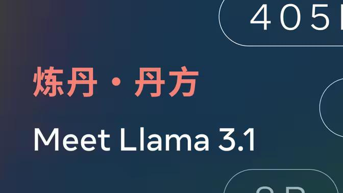         |   10:41 | 
 
                                                                                                                                                                                                                                                                                                                                                                                                                                                                                      |
|  8/28/24 | Llama 3.1论文精读 · 4. 训练infra                                                                                                                                                                                                                                                                                | 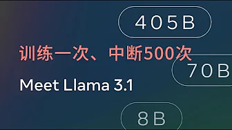 |   25:04 | 
 
                                                                                                                                                                                                                                                                                                                                            |
|  8/13/24 | Llama 3.1论文精读 · 3. 模型                                                                                                                                                                                                                                                                                     | 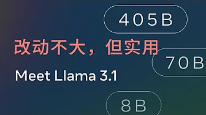          |   26:14 | 
 
                                                                                                                                                                                                                                                                                                                                            |
|  8/05/24 | [Llama 3.1论文精读 · 2. 预训练数据](https://arxiv.org/pdf/2407.21783)                                                                                                                                                                                                                                              | 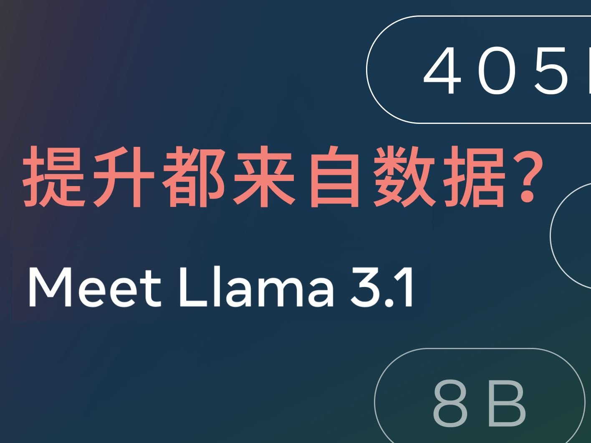   |   23:37 |                                                                                                                                                                                                                                                                                                                                                                                                                          |
|  7/31/24 | Llama 3.1论文精读 · 1. 导言                                                                                                                                                                                                                                                                                     | 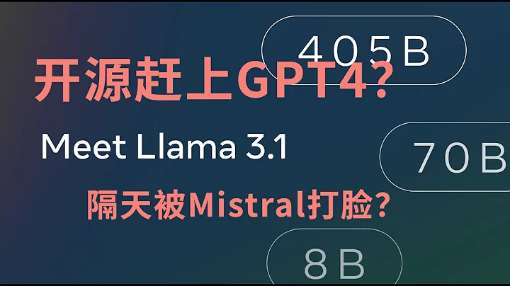           |   18:53 | 
 
                                                                                                                                                                                                                                                                                                                                            |
|  3/30/23 | [GPT-4](https://openai.com/research/gpt-4)                                                                                                                                                                                                                                                                |                    | 1:20:38 | 
 
                                                                                                                                                                                                                                                                                                                                                           |
|  3/23/23 | 大模型时代下做科研的四个思路                                                                                                                                                                                                                                                                                            |       | 1:06:29 | 
 
                                                                                                                                                                                                                                                                                                                                                           |
|  3/10/23 | [Anthropic LLM](https://arxiv.org/pdf/2204.05862.pdf)                                                                                                                                                                                                                                                     | 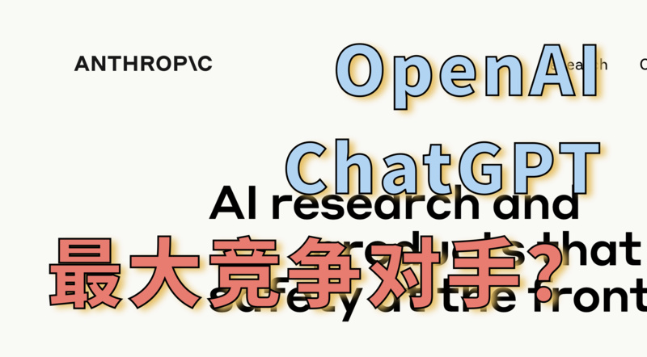           | 1:01:51 | 
 
                                                                                                                                                                                                                                                                                                                                                           |
|  1/20/23 | [Helm](https://arxiv.org/pdf/2211.09110.pdf) 全面语言模型评测                                                                                                                                                                                                                                                     |                    | 1:23:37 | 
 
                                                                                                                                                                                                                                                                                                                                                           |
|  1/11/23 | 多模态论文串讲·下                                                                                                                                                                                                                                                                                                 | 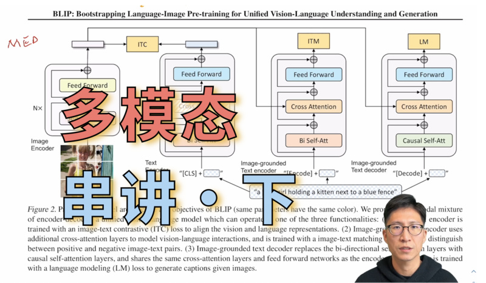           | 1:03:29 | 
 
                                                                                                                                                                                                                                                                                                                                                           |
| 12/29/22 | [Instruct GPT](https://arxiv.org/pdf/2203.02155.pdf)                                                                                                                                                                                                                                                      | 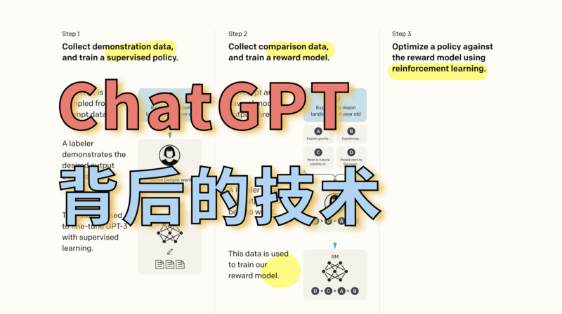           | 1:07:10 | 
 
                                                                                                                                                                                                                                                                                                                                                           |
| 12/19/22 | [Neural Corpus Indexer](https://arxiv.org/pdf/2206.02743.pdf) 文档检索                                                                                                                                                                                                                                        |                     |   55:47 | 
 
                                                                                                                                                                                                                                                                                                                                                           |
| 12/12/22 | 多模态论文串讲·上                                                                                                                                                                                                                                                                                                 | 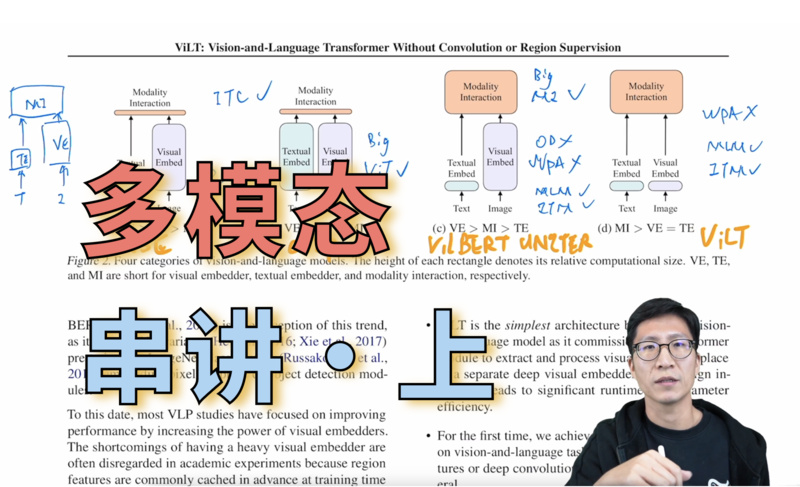           | 1:12:27 | 
 
                                                                                                                                                                                                                                                                                                                                                           |
| 11/14/22 | [OpenAI Whisper](https://cdn.openai.com/papers/whisper.pdf) 精读                                                                                                                                                                                                                                            | 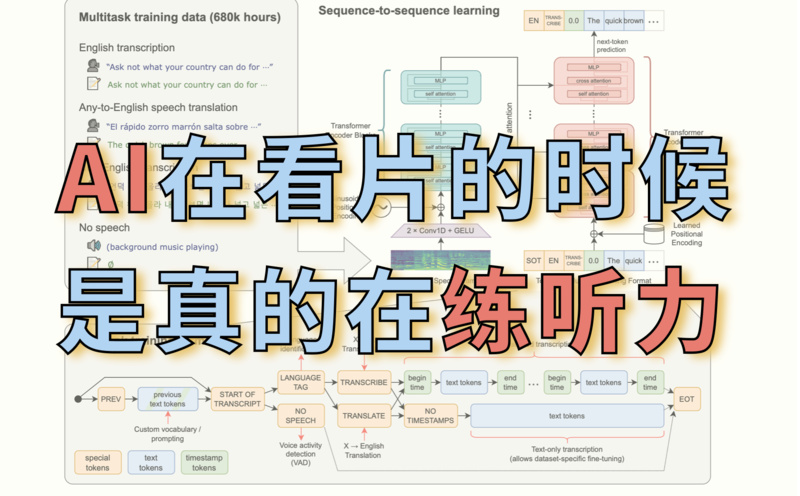                | 1:12:16 | 
 
                                                                                                                                                                                                                                                                                                                                                           |
| 11/07/22 | 在讲 OpenAI Whisper 前先做了一个剪视频小工具                                                                                                                                                                                                                                                                            | 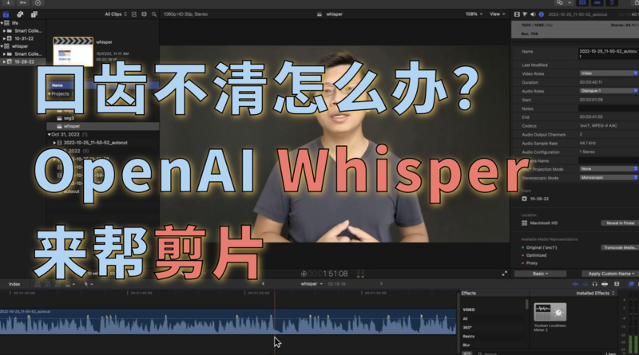                |   23:39 | 
 
                                                                                                                                                                                                                                                                                                                                                           |
| 10/23/22 | [Chain of Thought](https://arxiv.org/pdf/2201.11903.pdf) 论文、代码和资源                                                                                                                                                                                                                                         |                     |   33:21 | 
 
                                                                                                                                                                                                                                                                                                                                                           |
|  9/17/22 | CLIP 改进工作串讲（下）                                                                                                                                                                                                                                                                                            | 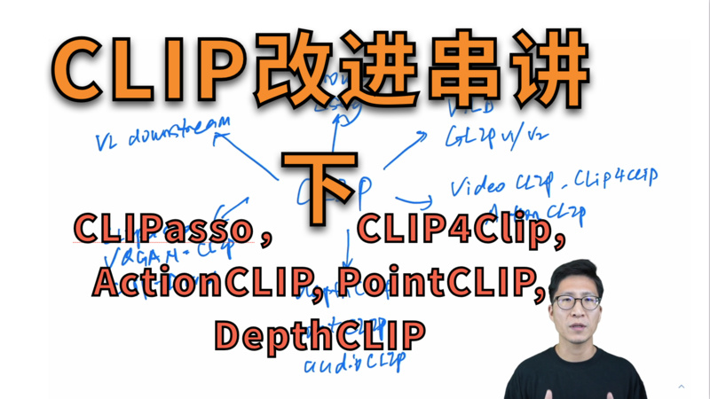            | 1:04:26 | 
 
                                                                                                                                                                                                                                                                                                                                                           |
|   9/2/22 | CLIP 改进工作串讲（上）                                                                                                                                                                                                                                                                                            |             | 1:14:43 | 
 
                                                                                                                                                                                                                                                                                                                                                           |
|  7/29/22 | [ViLT](https://arxiv.org/pdf/2102.03334.pdf) 论文精读                                                                                                                                                                                                                                                         |                    | 1:03:26 | 
 
                                                                                                                                                                                                                                                                                                                                                           |
|  7/22/22 | 理由、论据和担保【[研究的艺术](https://press.uchicago.edu/ucp/books/book/chicago/C/bo23521678.html)·四】                                                                                                                                                                                                                  |       |   44:14 |                                                                                                                                                                                                                                                                                                                                                                                                                                                                                                                                           |
|  7/15/22 | 如何讲好故事、故事里的论点【[研究的艺术](https://press.uchicago.edu/ucp/books/book/chicago/C/bo23521678.html)·三】                                                                                                                                                                                                             |       |   43:56 |                                                                                                                                                                                                                                                                                                                                                                                                                                                                                                                                           |
|   7/8/22 | [DALL·E 2](https://arxiv.org/pdf/2204.06125.pdf) 逐段精读                                                                                                                                                                                                                                                     |                  | 1:27:54 | 
 
                                                                                                                                                                                                                                                                                                                                                           |
|   7/1/22 | 明白问题的重要性【[研究的艺术](https://press.uchicago.edu/ucp/books/book/chicago/C/bo23521678.html)·二】                                                                                                                                                                                                                  |       | 1:03:40 |                                                                                                                                                                                                                                                                                                                                                                                                                                                                                                                                          |
|  6/24/22 | 跟读者建立联系【[研究的艺术](https://press.uchicago.edu/ucp/books/book/chicago/C/bo23521678.html)·一】                                                                                                                                                                                                                   |       |   45:01 |                                                                                                                                                                                                                                                                                                                                                                                                                                                                                                                                          |
|  6/17/22 | [Zero](https://arxiv.org/pdf/1910.02054.pdf) 逐段精读                                                                                                                                                                                                                                                         | 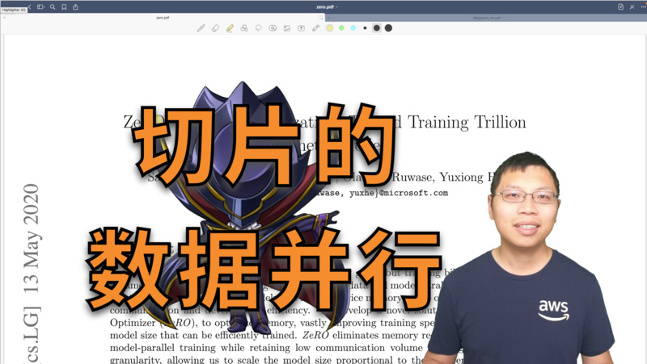                   |   52:21 |                                                                                                                                                                                                                                                                                                                                                                                                                                                                                                                                          |
|  6/10/22 | [DETR](https://arxiv.org/pdf/2005.12872.pdf) 逐段精读                                                                                                                                                                                                                                                         |                    |   54:22 |                                                                                                                                                                                                                                                                                                                                                                                                                                                                                                                                          |
|   6/3/22 | [Megatron LM](https://arxiv.org/pdf/1909.08053.pdf) 逐段精读                                                                                                                                                                                                                                                  |             |   56:07 |                                                                                                                                                                                                                                                                                                                                                                                                                                                                                                                                          |
|  5/27/22 | [GPipe](https://proceedings.neurips.cc/paper/2019/file/093f65e080a295f8076b1c5722a46aa2-Paper.pdf) 逐段精读                                                                                                                                                                                                   | 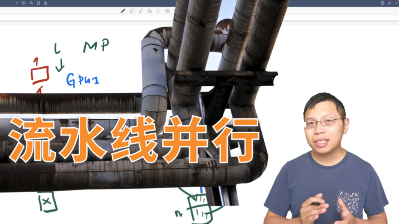                  |   58:47 | 
 
                                                                                                                                                                                                                                                                                                                                                          |
|   5/5/22 | [Pathways](https://arxiv.org/pdf/2203.12533.pdf) 逐段精读                                                                                                                                                                                                                                                     |                | 1:02:13 | 
 
                                                                                                                                                                                                                                                                                                                                                          |
|  4/28/22 | [视频理解论文串讲](https://arxiv.org/pdf/2012.06567.pdf)（下）                                                                                                                                                                                                                                                       |         | 1:08:32 | 
 
                                                                                                                                                                                                                                                                                                                                                          |
|  4/21/22 | [参数服务器（Parameter Server）](https://www.usenix.org/system/files/conference/osdi14/osdi14-paper-li_mu.pdf) 逐段精读                                                                                                                                                                                              | 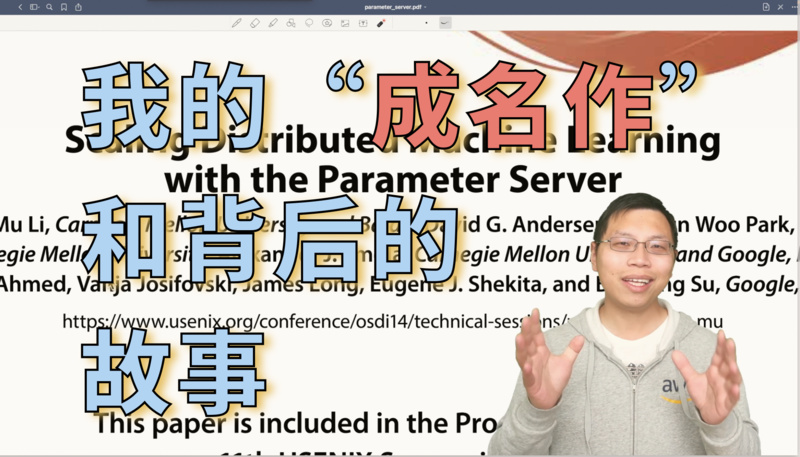                     | 1:37:40 | 
 
                                                                                                                                                                                                                                                                                                                                                          |
|  4/14/22 | [视频理解论文串讲](https://arxiv.org/pdf/2012.06567.pdf)（上）                                                                                                                                                                                                                                                       |         |   51:15 | 
 
                                                                                                                                                                                                                                                                                                                                                          |
|  3/31/22 | [I3D](https://arxiv.org/pdf/1705.07750.pdf) 论文精读                                                                                                                                                                                                                                                          |                     |   52:31 | 
 
                                                                                                                                                                                                                                                                                                                                                          |
|  3/24/22 | 斯坦福 2022 年 [AI 指数报告](https://aiindex.stanford.edu/wp-content/uploads/2022/03/2022-AI-Index-Report_Master.pdf) 精读                                                                                                                                                                                          |             | 1:19:56 | 
 
                                                                                                                                                                                                                                                                                                                                                          |
|  3/17/22 | [AlphaCode](https://storage.googleapis.com/deepmind-media/AlphaCode/competition_level_code_generation_with_alphacode.pdf) 论文精读                                                                                                                                                                            | 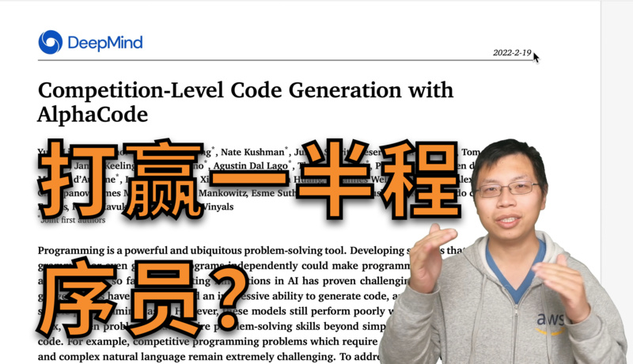              |   44:00 | 
 
                                                                                                                                                                                                                                                                                                                                                          |
|  3/10/22 | [OpenAI Codex](https://arxiv.org/pdf/2107.03374.pdf) 论文精读                                                                                                                                                                                                                                                 |                   |   47:58 | 
  
                                                                          |
|   3/3/22 | [GPT](https://s3-us-west-2.amazonaws.com/openai-assets/research-covers/language-unsupervised/language_understanding_paper.pdf), [GPT-2](https://d4mucfpksywv.cloudfront.net/better-language-models/language_models_are_unsupervised_multitask_learners.pdf), [GPT-3](https://arxiv.org/abs/2005.14165) 精读 |                    | 1:29:58 | 
 
                                                                                                                                                                                                                                                                                                                                                          |
|  2/24/22 | [Two-Stream](https://proceedings.neurips.cc/paper/2014/file/00ec53c4682d36f5c4359f4ae7bd7ba1-Paper.pdf) 逐段精读                                                                                                                                                                                              |               |   52:57 | 
 
                                                                                                                                                                                                                                                                                                                                                          |
|  2/10/22 | [CLIP](https://openai.com/blog/clip/) 逐段精读                                                                                                                                                                                                                                                                |                    | 1:38:25 | 
  
                                                                          |
|   2/6/22 | 你（被）吐槽过[论文不够 novel](https://perceiving-systems.blog/en/post/novelty-in-science) 吗？                                                                                                                                                                                                                        |                 |   14:11 | 
 
                                                                                                                                                                                                         |
|  1/23/22 | [AlphaFold 2](https://www.nature.com/articles/s41586-021-03819-2.pdf) 精读                                                                                                                                                                                                                                  |             | 1:15:28 | 
  
                                                                          |
|  1/18/22 | 如何判断（你自己的）研究工作的价值                                                                                                                                                                                                                                                                                         |          |    9:59 | 
 
                                                                                                                                                                                                         |
|  1/15/22 | [Swin Transformer](https://arxiv.org/pdf/2103.14030.pdf) 精读                                                                                                                                                                                                                                               | 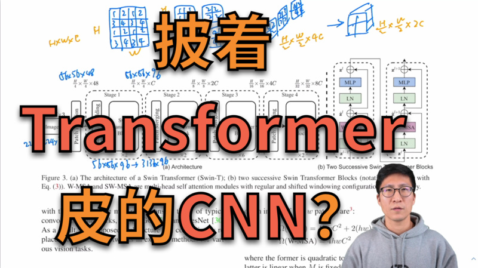       | 1:00:21 | 
  
                                                                          |
|   1/7/22 | [指导数学直觉](https://www.nature.com/articles/s41586-021-04086-x.pdf)                                                                                                                                                                                                                                          | 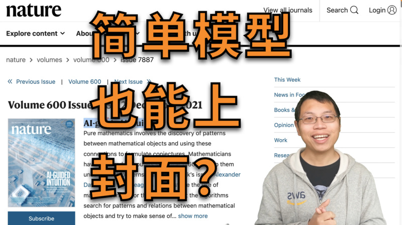              |   52:51 | 
  
                                                                          |
|   1/5/22 | AlphaFold 2 预告                                                                                                                                                                                                                                                                                            |     |   03:28 |                                                                                                                                                                                                                                                                                                                                                                                                                                                                                                                                          |
| 12/20/21 | [对比学习](paper-reading-main.md#contrastive_learning)论文综述                                                                                                                                                                                                                                                    |             | 1:32:01 | 
  
                                                           |
| 12/15/21 | [MoCo](https://arxiv.org/pdf/1911.05722.pdf) 逐段精读                                                                                                                                                                                                                                                         |                  | 1:24:11 | 
  
                                                           |
|  12/9/21 | 如何找研究想法 1                                                                                                                                                                                                                                                                                                 |                |    5:34 |                                                                                                                                                                                                                                                                                                                                                                                                                                                                                                                                          |
|  12/8/21 | [MAE](https://arxiv.org/pdf/2111.06377.pdf) 逐段精读                                                                                                                                                                                                                                                          | 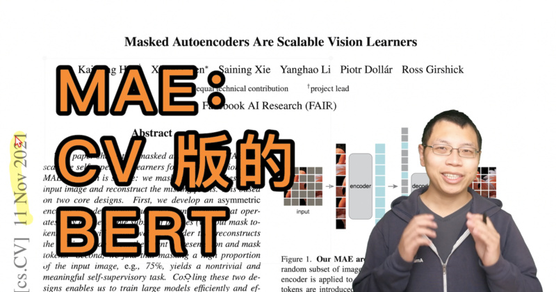                    |   47:04 | 
  
                                                                          |
| 11/29/21 | [ViT](https://arxiv.org/pdf/2010.11929.pdf) 逐段精读                                                                                                                                                                                                                                                          |                     | 1:11:30 | 
  
                                                                          |
| 11/18/21 | [BERT](https://arxiv.org/abs/1810.04805) 逐段精读                                                                                                                                                                                                                                                             |                    |   45:49 | 
  
                                                                          |
|  11/9/21 | [GAN](https://papers.nips.cc/paper/2014/file/5ca3e9b122f61f8f06494c97b1afccf3-Paper.pdf) 逐段精读                                                                                                                                                                                                             |                     |   46:16 | 
  
                                                           |
|  11/3/21 | 零基础多图详解 [图神经网络](https://distill.pub/2021/gnn-intro/)（GNN/GCN）                                                                                                                                                                                                                                             | 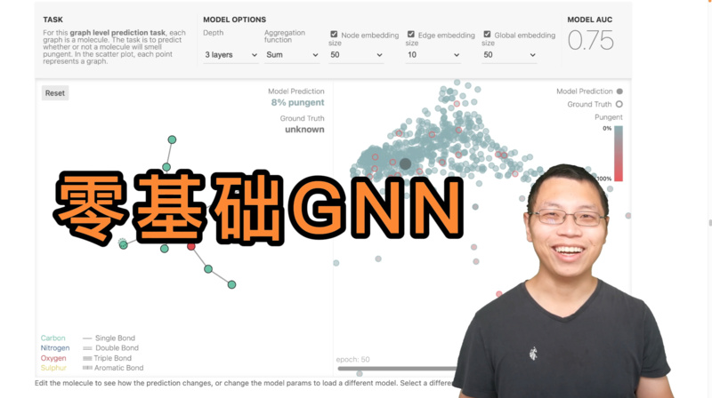                    | 1:06:19 | 
  
                                                                          |
| 10/27/21 | 
<a href="https://arxiv.org/abs/1706.03762">Transformer</a> 逐段精读 （视频中提到的文献 )
                                                                                                                                                                                                                     |             | 1:27:05 | 
  
                                                                          |
| 10/22/21 | [ResNet](https://arxiv.org/abs/1512.03385) 论文逐段精读                                                                                                                                                                                                                                                         |                |   53:46 | 
  
                                                           |
| 10/21/21 | 撑起计算机视觉半边天的 [ResNet](https://arxiv.org/abs/1512.03385)                                                                                                                                                                                                                                                    |                |   11:50 | 
  
                                                           |
| 10/15/21 | [AlexNet](https://papers.nips.cc/paper/2012/file/c399862d3b9d6b76c8436e924a68c45b-Paper.pdf) 论文逐段精读                                                                                                                                                                                                       | 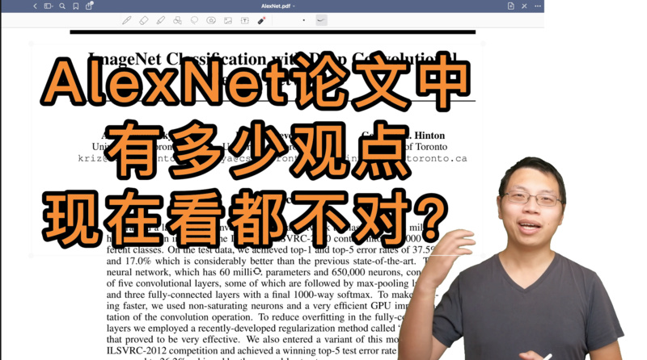              |   55:21 | 
  
                                                           |
| 10/14/21 | 9年后重读深度学习奠基作之一：[AlexNet](https://papers.nips.cc/paper/2012/file/c399862d3b9d6b76c8436e924a68c45b-Paper.pdf)                                                                                                                                                                                               | 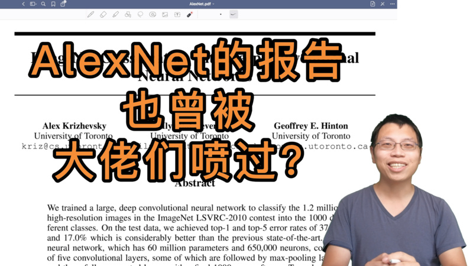              |   19:59 | 
  
                                                           |
| 10/06/21 | 如何读论文                                                                                                                                                                                                                                                                                                     |              |   06:39 | 
  
 |

## 所有论文

包括已经录制完成和之后将要介绍的论文。选取的原则是10年内深度学习里有影响力文章（必读文章），或者近期比较有意思的文章。当然这十年里重要的工作太多了，不可能一一过一遍。在选取的时候我会偏向一些之前 [直播课](https://c.d2l.ai/zh-v2/) 中没讲到过的。 欢迎大家在 [讨论区](https://github.com/mli/paper-reading/discussions) 里提供建（点）议（歌）。

总论文数 67，录制完成数 32

（这里引用采用的是 semanticscholar，是因为它提供 [API](https://api.semanticscholar.org/api-docs/graph#operation/get_graph_get_paper) 可以自动获取，不用手动更新。）

### 计算机视觉 - CNN

| 已录制 | 年份   | 名字                                                                                           | 简介                      | 引用                                                                                                                                                                                                                                                                                                                                                                                    |
| --- | ---- | -------------------------------------------------------------------------------------------- | ----------------------- | ------------------------------------------------------------------------------------------------------------------------------------------------------------------------------------------------------------------------------------------------------------------------------------------------------------------------------------------------------------------------------------- |
| ✅   | 2012 | [AlexNet](https://papers.nips.cc/paper/2012/file/c399862d3b9d6b76c8436e924a68c45b-Paper.pdf) | 深度学习热潮的奠基作              |  |
|     | 2014 | [VGG](https://arxiv.org/pdf/1409.1556.pdf)                                                   | 使用 3x3 卷积构造更深的网络        |   |
|     | 2014 | [GoogleNet](https://arxiv.org/pdf/1409.4842.pdf)                                             | 使用并行架构构造更深的网络           |                            |
| ✅   | 2015 | [ResNet](https://arxiv.org/pdf/1512.03385.pdf)                                               | 构建深层网络都要有的残差连接。         |                 |
|     | 2017 | [MobileNet](https://arxiv.org/pdf/1704.04861.pdf)                                            | 适合终端设备的小CNN             |      |
|     | 2019 | [EfficientNet](https://arxiv.org/pdf/1905.11946.pdf)                                         | 通过架构搜索得到的CNN            |            |
|     | 2021 | [Non-deep networks](https://arxiv.org/pdf/2110.07641.pdf)                                    | 让不深的网络也能在ImageNet刷到SOTA |                                   |

### 计算机视觉 - Transformer

| 已录制 | 年份   | 名字                                                       | 简介                     | 引用                                                                                                                                                                                                                                                                                                                                                                                      |
| --- | ---- | -------------------------------------------------------- | ---------------------- | --------------------------------------------------------------------------------------------------------------------------------------------------------------------------------------------------------------------------------------------------------------------------------------------------------------------------------------------------------------------------------------- |
| ✅   | 2020 | [ViT](https://arxiv.org/pdf/2010.11929.pdf)              | Transformer杀入CV界       |  |
| ✅   | 2021 | [Swin Transformer](https://arxiv.org/pdf/2103.14030.pdf) | 多层次的Vision Transformer |             |
|     | 2021 | [MLP-Mixer](https://arxiv.org/pdf/2105.01601.pdf)        | 使用MLP替换self-attention  |      |
| ✅   | 2021 | [MAE](https://arxiv.org/pdf/2111.06377.pdf)              | BERT的CV版               |                |

### 生成模型

| 已录制 | 年份   | 名字                                                                                       | 简介                                | 引用                                                                                                                                                                                                                                                                                                                                                                                   |
| --- | ---- | ---------------------------------------------------------------------------------------- | --------------------------------- | ------------------------------------------------------------------------------------------------------------------------------------------------------------------------------------------------------------------------------------------------------------------------------------------------------------------------------------------------------------------------------------ |
| ✅   | 2014 | [GAN](https://papers.nips.cc/paper/2014/file/5ca3e9b122f61f8f06494c97b1afccf3-Paper.pdf) | 生成模型的开创工作                         |                 |
|     | 2015 | [DCGAN](https://arxiv.org/pdf/1511.06434.pdf)                                            | 使用CNN的GAN                         |          |
|     | 2016 | [pix2pix](https://arxiv.org/pdf/1611.07004.pdf)                                          |                                   |                |
|     | 2016 | [SRGAN](https://arxiv.org/pdf/1609.04802.pdf)                                            | 图片超分辨率                            |      |
|     | 2017 | [WGAN](https://arxiv.org/abs/1701.07875)                                                 | 训练更加容易                            |                                    |
|     | 2017 | [CycleGAN](https://arxiv.org/abs/1703.10593)                                             |                                   |          |
|     | 2018 | [StyleGAN](https://arxiv.org/abs/1812.04948)                                             |                                   |     |
|     | 2019 | [StyleGAN2](https://arxiv.org/pdf/1912.04958.pdf)                                        |                                   |            |
|     | 2020 | [DDPM](https://arxiv.org/pdf/2006.11239.pdf)                                             | Diffusion Models                  |                     |
|     | 2021 | [Improved DDPM](https://arxiv.org/pdf/2102.09672.pdf)                                    | 改进的 DDPM                          |    |
|     | 2021 | [Guided Diffusion Models](https://arxiv.org/pdf/2105.05233.pdf)                          | 号称超越 GAN                          |        |
|     | 2021 | [StyleGAN3](https://arxiv.org/pdf/2106.12423.pdf)                                        |                                   |            |
| ✅   | 2022 | [DALL.E 2](https://arxiv.org/pdf/2204.06125.pdf)                                         | CLIP + Diffusion models，文本生成图像新高度 |  |
| ✅   | 2024 | [Sora](https://openai.com/index/video-generation-models-as-world-simulators/)            | 开启视频生成热潮                          |                                                                                                                                                                                                                                                                                                                                                                                      |
| ✅   | 2024 | [Movie Gen](https://arxiv.org/pdf/2410.13720)                                            | 精确的文本指导视频编辑、个性化视频生成               |                                                                                                                                                                                                                                                                                                                                                                                      |
| ✅   | 2025 | [HunyuanVideo](https://arxiv.org/pdf/2412.03603)                                         | 开源视频生成框架                          |                                                                                                                                                                                                                                                                                                                                                                                      |

### 计算机视觉 - Object Detection

| 已录制 | 年份   | 名字                                                | 简介           | 引用                                                                                                                                                                                                                                                                                                                                                                          |
| --- | ---- | ------------------------------------------------- | ------------ | --------------------------------------------------------------------------------------------------------------------------------------------------------------------------------------------------------------------------------------------------------------------------------------------------------------------------------------------------------------------------- |
|     | 2014 | [R-CNN](https://arxiv.org/pdf/1311.2524v5.pdf)    | Two-stage    |                                                             |
|     | 2015 | [Fast R-CNN](http://arxiv.org/abs/1504.08083v2)   |              |                                                             |
|     | 2015 | [Faster R-CNN](http://arxiv.org/abs/1506.01497v3) |              |                                                             |
|     | 2016 | [SSD](http://arxiv.org/abs/1512.02325v5)          | Single stage |                                                             |
|     | 2016 | [YOLO](http://arxiv.org/abs/1506.02640v5)         |              |                                                             |
|     | 2017 | [Mask R-CNN](http://arxiv.org/abs/1703.06870v3)   |              |                                                             |
|     | 2017 | [YOLOv2](http://arxiv.org/abs/1612.08242v1)       |              |                                                             |
|     | 2018 | [YOLOv3](http://arxiv.org/abs/1804.02767v1)       |              |                                                             |
|     | 2019 | [CenterNet](https://arxiv.org/pdf/1904.07850.pdf) | Anchor free  |                                 |
| ✅   | 2020 | [DETR](https://arxiv.org/pdf/2005.12872.pdf)      | Transformer  |  |

### 计算机视觉 - 对比学习

| 已录制 | 年份   | 名字                                                 | 简介                                    | 引用                                                                                                                                                                                                                                                                                                                                                                               |
| --- | ---- | -------------------------------------------------- | ------------------------------------- | -------------------------------------------------------------------------------------------------------------------------------------------------------------------------------------------------------------------------------------------------------------------------------------------------------------------------------------------------------------------------------- |
| ✅   | 2018 | [InstDisc](https://arxiv.org/pdf/1805.01978.pdf)   | 提出实例判别和memory bank做对比学习               |        |
| ✅   | 2018 | [CPC](https://arxiv.org/pdf/1807.03748.pdf)        | 对比预测编码，图像语音文本强化学习全都能做                 |      |
| ✅   | 2019 | [InvaSpread](https://arxiv.org/pdf/1904.03436.pdf) | 一个编码器的端到端对比学习                         |       |
| ✅   | 2019 | [CMC](https://arxiv.org/pdf/1906.05849.pdf)        | 多视角下的对比学习                             |                       |
| ✅   | 2019 | [MoCov1](https://arxiv.org/pdf/1911.05722.pdf)     | 无监督训练效果也很好                            |        |
| ✅   | 2020 | [SimCLRv1](https://arxiv.org/pdf/2002.05709.pdf)   | 简单的对比学习 (数据增强 + MLP head + 大batch训练久) |    |
| ✅   | 2020 | [MoCov2](https://arxiv.org/pdf/2003.04297.pdf)     | MoCov1 + improvements from SimCLRv1   |            |
| ✅   | 2020 | [SimCLRv2](https://arxiv.org/pdf/2006.10029.pdf)   | 大的自监督预训练模型很适合做半监督学习                   |    |
| ✅   | 2020 | [BYOL](https://arxiv.org/pdf/2006.07733.pdf)       | 不需要负样本的对比学习                           |       |
| ✅   | 2020 | [SWaV](https://arxiv.org/pdf/2006.09882.pdf)       | 聚类对比学习                                |  |
| ✅   | 2020 | [SimSiam](https://arxiv.org/pdf/2011.10566.pdf)    | 化繁为简的孪生表征学习                           |         |
| ✅   | 2021 | [MoCov3](https://arxiv.org/pdf/2104.02057.pdf)     | 如何更稳定的自监督训练ViT                        |          |
| ✅   | 2021 | [DINO](https://arxiv.org/pdf/2104.14294.pdf)       | transformer加自监督在视觉也很香                 |      |

### 计算机视觉 - 视频理解

| 已录制 | 年份   | 名字                                                              | 简介                                        | 引用                                                                                                                                                                                                                                                                                                                                                                                      |
| --- | ---- | --------------------------------------------------------------- | ----------------------------------------- | --------------------------------------------------------------------------------------------------------------------------------------------------------------------------------------------------------------------------------------------------------------------------------------------------------------------------------------------------------------------------------------- |
| ✅   | 2014 | [DeepVideo](https://cs.stanford.edu/people/karpathy/deepvideo/) | 提出sports1M数据集，用深度学习做视频理解                  |   |
| ✅   | 2014 | [Two-stream](https://arxiv.org/pdf/1406.2199.pdf)               | 引入光流做时序建模，神经网络首次超越手工特征                    |      |
| ✅   | 2014 | [C3D](https://arxiv.org/pdf/1412.0767.pdf)                      | 比较深的3D-CNN做视频理解                           |          |
| ✅   | 2015 | [Beyond-short-snippets](https://arxiv.org/pdf/1503.08909.pdf)   | 尝试使用LSTM                                  |          |
| ✅   | 2016 | [Convolutional fusion](https://arxiv.org/pdf/1604.06573.pdf)    | 做early fusion来加强时空间建模                     |    |
| ✅   | 2016 | [TSN](https://arxiv.org/pdf/1608.00859.pdf)                     | 超级有效的视频分段建模，bag of tricks in video        |          |
| ✅   | 2017 | [I3D](https://arxiv.org/pdf/1705.07750.pdf)                     | 提出Kinetics数据集，膨胀2D网络到3D，开启3D-CNN时代        |  |
| ✅   | 2017 | [R2+1D](https://arxiv.org/pdf/1711.11248.pdf)                   | 拆分3D卷积核，使3D网络容易优化                         |              |
| ✅   | 2017 | [Non-local](https://arxiv.org/pdf/1711.07971.pdf)               | 引入自注意力做视觉问题                               |                                 |
| ✅   | 2018 | [SlowFast](https://arxiv.org/pdf/1812.03982.pdf)                | 快慢两支提升效率                                  |               |
| ✅   | 2021 | [TimeSformer](https://arxiv.org/pdf/2102.05095.pdf)             | 视频中第一个引入transformer，开启video transformer时代 |           |

### 多模态学习

| 已录制 | 年份   | 名字                                                 | 简介                    | 引用                                                                                                                                                                                                                                                                                                                                                                                   |
| --- | ---- | -------------------------------------------------- | --------------------- | ------------------------------------------------------------------------------------------------------------------------------------------------------------------------------------------------------------------------------------------------------------------------------------------------------------------------------------------------------------------------------------ |
| ✅   | 2021 | [CLIP](https://openai.com/blog/clip/)              | 图片和文本之间的对比学习          |         |
| ✅   | 2021 | [ViLT](https://arxiv.org/pdf/2102.03334.pdf)       | 第一个摆脱了目标检测的视觉文本模型     |           |
| ✅   | 2021 | [ViLD](https://arxiv.org/pdf/2104.13921.pdf)       | CLIP蒸馏帮助开集目标检测        |               |
| ✅   | 2021 | [GLIP](https://arxiv.org/pdf/2112.03857.pdf)       | 联合目标检测和文本定位           |                        |
| ✅   | 2021 | [CLIP4Clip](https://arxiv.org/pdf/2104.08860.pdf)  | 拿CLIP直接做视频文本retrieval |            |
| ✅   | 2021 | [ActionCLIP](https://arxiv.org/pdf/2109.08472.pdf) | 用多模态对比学习有监督的做视频动作分类   |              |
| ✅   | 2021 | [PointCLIP](https://arxiv.org/pdf/2112.02413.pdf)  | 3D变2D，巧妙利用CLIP做点云     |             |
| ✅   | 2022 | [LSeg](https://arxiv.org/pdf/2201.03546.pdf)       | 有监督的开集分割              |                  |
| ✅   | 2022 | [GroupViT](https://arxiv.org/pdf/2202.11094.pdf)   | 只用图像文本对也能无监督做分割       |         |
| ✅   | 2022 | [CLIPasso](https://arxiv.org/pdf/2202.05822.pdf)   | CLIP跨界生成简笔画           |  |
| ✅   | 2022 | [DepthCLIP](https://arxiv.org/pdf/2207.01077.pdf)  | 用文本跨界估计深度             |                             |

### 自然语言处理 - Transformer

| 已录制 | 年份   | 名字                                                                                                                             | 简介                                   | 引用                                                                                                                                                                                                                                                                                                                                                                                 |
| --- | ---- | ------------------------------------------------------------------------------------------------------------------------------ | ------------------------------------ | ---------------------------------------------------------------------------------------------------------------------------------------------------------------------------------------------------------------------------------------------------------------------------------------------------------------------------------------------------------------------------------- |
| ✅   | 2017 | [Transformer](https://arxiv.org/abs/1706.03762)                                                                                | 继MLP、CNN、RNN后的第四大类架构                 |                          |
| ✅   | 2018 | [GPT](https://s3-us-west-2.amazonaws.com/openai-assets/research-covers/language-unsupervised/language_understanding_paper.pdf) | 使用 Transformer 解码器来做预训练              |  |
| ✅   | 2018 | [BERT](https://arxiv.org/abs/1810.04805)                                                                                       | Transformer一统NLP的开始                  |        |
| ✅   | 2019 | [GPT-2](https://d4mucfpksywv.cloudfront.net/better-language-models/language_models_are_unsupervised_multitask_learners.pdf)    | 更大的 GPT 模型，朝着zero-shot learning迈了一大步 |     |
| ✅   | 2020 | [GPT-3](https://arxiv.org/abs/2005.14165)                                                                                      | 100倍更大的 GPT-2，few-shot learning效果显著  |                   |
| ✅   | 2024 | [Llama 3.1](https://arxiv.org/pdf/2407.21783)                                                                                  | 强大的Meta开源模型 - 动态扩展，多模态学习，零样本学习，高效计算  |                                                                    |

### 系统

| 已录制 | 年份   | 名字                                                                                                 | 简介              | 引用                                                                                                                                                                                                                                                                                                                                                                                        |
| --- | ---- | -------------------------------------------------------------------------------------------------- | --------------- | ----------------------------------------------------------------------------------------------------------------------------------------------------------------------------------------------------------------------------------------------------------------------------------------------------------------------------------------------------------------------------------------- |
| ✅   | 2014 | [参数服务器](https://www.usenix.org/system/files/conference/osdi14/osdi14-paper-li_mu.pdf)              | 支持千亿参数的传统机器学习模型 |                 |
| ✅   | 2018 | [GPipe](https://proceedings.neurips.cc/paper/2019/file/093f65e080a295f8076b1c5722a46aa2-Paper.pdf) | 流水线（Pipeline）并行 |          |
| ✅   | 2019 | [Megatron-LM](https://arxiv.org/pdf/1909.08053.pdf)                                                | 张量（Tensor）并行    |     |
| ✅   | 2019 | [Zero](https://arxiv.org/pdf/1910.02054.pdf)                                                       | 参数分片            |  |
| ✅   | 2022 | [Pathways](https://arxiv.org/pdf/2203.12533.pdf)                                                   | 将Jax拓展到上千TPU核上  |     |

### 图神经网络

| 已录制 | 年份   | 名字                                             | 简介        | 引用                                                                                                                                                                                                                                                                                                                                                                                          |
| --- | ---- | ---------------------------------------------- | --------- | ------------------------------------------------------------------------------------------------------------------------------------------------------------------------------------------------------------------------------------------------------------------------------------------------------------------------------------------------------------------------------------------- |
| ✅   | 2021 | [图神经网络介绍](https://distill.pub/2021/gnn-intro/) | GNN的可视化介绍 |  |

### 优化算法

| 已录制 | 年份   | 名字                                                  | 简介              | 引用                                                                                                                                                                                                                                                                                                                                                                            |
| --- | ---- | --------------------------------------------------- | --------------- | ----------------------------------------------------------------------------------------------------------------------------------------------------------------------------------------------------------------------------------------------------------------------------------------------------------------------------------------------------------------------------- |
|     | 2014 | [Adam](https://arxiv.org/abs/1412.6980)             | 深度学习里最常用的优化算法之一 |        |
|     | 2016 | [为什么超大的模型泛化性不错](https://arxiv.org/abs/1611.03530)   |                 |  |
|     | 2017 | [为什么Momentum有效](https://distill.pub/2017/momentum/) | Distill的可视化介绍   |                                 |

### 新领域应用

| 已录制 | 年份   | 名字                                                                                                                        | 简介                    | 引用                                                                                                                                                                                                                                                                                                                                                                                     |
| --- | ---- | ------------------------------------------------------------------------------------------------------------------------- | --------------------- | -------------------------------------------------------------------------------------------------------------------------------------------------------------------------------------------------------------------------------------------------------------------------------------------------------------------------------------------------------------------------------------- |
|     | 2016 | [AlphaGo](https://storage.googleapis.com/deepmind-media/alphago/AlphaGoNaturePaper.pdf)                                   | 强化学习出圈                |        |
|     | 2020 | [AlphaFold](https://discovery.ucl.ac.uk/id/eprint/10089234/1/343019_3_art_0_py4t4l_convrt.pdf)                            | 赢得比赛的的蛋白质3D结构预测       |          |
| ✅   | 2021 | [AlphaFold 2](https://www.nature.com/articles/s41586-021-03819-2.pdf)                                                     | 原子级别精度的蛋白质3D结构预测      |         |
| ✅   | 2021 | [Codex](https://arxiv.org/pdf/2107.03374.pdf)                                                                             | 使用注释生成代码              |           |
| ✅   | 2021 | [指导数学直觉](https://www.nature.com/articles/s41586-021-04086-x.pdf)                                                          | 分析不同数学物体之前的联系来帮助发现新定理 |  |
| ✅   | 2022 | [AlphaCode](https://storage.googleapis.com/deepmind-media/AlphaCode/competition_level_code_generation_with_alphacode.pdf) | 媲美一般程序员的编程解题水平        |               |
